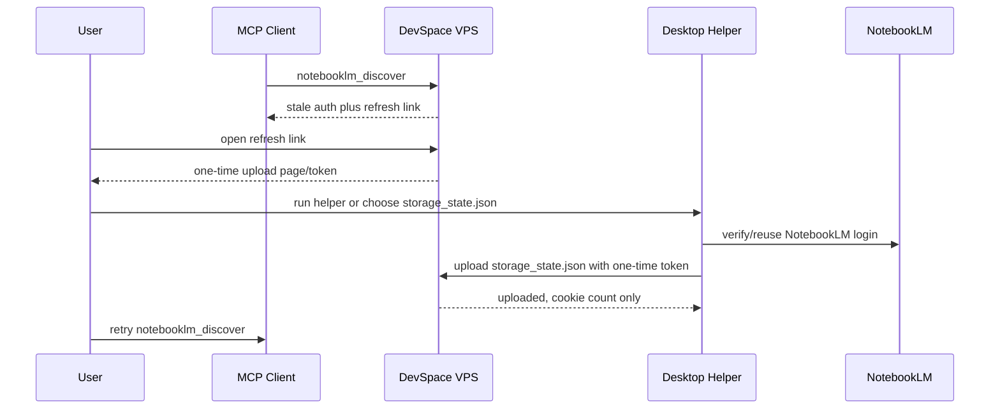

# NotebookLM Auth Refresh Design

## Goal

Make stale NotebookLM authentication repair feel like a normal app authorization
flow: the MCP tool returns a link, the user opens it on a signed-in desktop, and
DevSpace refreshes the VPS NotebookLM browser state without manual SSH or token
copying.

## Constraints

NotebookLM does not expose a stable public API or OAuth consent flow for the
browser automation used by this project. DevSpace therefore cannot receive a
Google cookie just because the user opens a Google login URL. Browser security
keeps Google cookies scoped to Google domains.

The supported repair flow must collect a portable Playwright/Patchright
`storage_state.json` from a user-controlled desktop browser automation context
and upload it to the DevSpace deployment. Raw Chrome profile cookie databases
are not portable from Windows to Linux because Chrome encrypts them with the
host OS credential store.

## User Experience

When `notebooklm_status`, `notebooklm_discover`, or `notebooklm_research`
detects stale Google authentication, the response should include one clear next
action:

1. Open a DevSpace auth-refresh link.
2. Complete or reuse NotebookLM login on the current desktop.
3. Let the helper upload a fresh browser state to the VPS.
4. Retry the original NotebookLM tool.

The first implementation can expose the server-side upload endpoint and repair
instructions. A later desktop helper can make the browser capture step fully
automatic.

## Architecture

DevSpace will add a small NotebookLM auth-refresh service alongside existing
NotebookLM workflow code.

- `src/notebooklm-auth-refresh.ts` owns one-time upload token creation,
  validation, target path resolution, JSON validation, and safe file writes.
- `src/server.ts` exposes HTTP endpoints under `/notebooklm/auth-refresh/*`
  protected by the existing owner-token form flow for link creation and a
  one-time upload token for state upload.
- NotebookLM workflow repair hints point users to the refresh flow when stale
  auth is detected.

The endpoint writes only to the configured NotebookLM browser state path and
uses `0600` permissions. It must never log or return cookie values.

## Data Flow

## Error Handling

Invalid upload tokens return `401` without revealing whether any browser state
exists. Malformed JSON, missing `cookies`, or missing `origins` returns `400`.
Expired tokens return `410`. Successful upload returns cookie and origin counts
only.

If the uploaded state is still rejected by Google, discovery should continue to
return `browser_failed` with the same refresh action. DevSpace should not delete
the local NotebookLM library or sessions when auth refresh fails.

## Testing

Unit tests should cover token creation, expiration, one-time use, JSON
validation, and atomic browser-state writes. Server tests should cover the HTTP
upload path without using real Google credentials.

Manual deployment verification on the Ubuntu VPS should confirm:

- `devspace.service` and `cloudflared.service` remain active after restart.
- `/healthz` works locally and through the tunnel.
- `/mcp` still requires MCP auth.
- the NotebookLM browser state file is written with mode `0600`.
